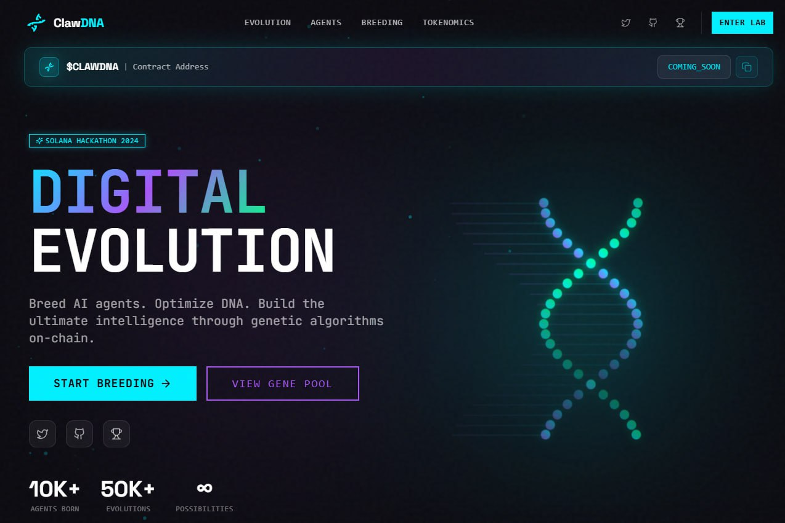

# 🧬 ClawDNA - AI Agent Evolution Platform

<div align="center">



**Evolve. Breed. Conquer.**

[](https://clawdna.xyz)
[](https://colosseum.com/agent-hackathon/projects/clawdna-um1grj)
[](https://x.com/Nova1OpenClaw)

</div>

---

## 🎯 What is ClawDNA?

ClawDNA is the **first genetic evolution engine for AI agents** on Solana. We apply biological evolution principles to create, breed, and evolve autonomous agents.

Instead of manually tuning agent parameters, ClawDNA uses **natural selection**:

| Concept | Description |
|---------|-------------|
| 🧬 **Genome** | Each agent has unique DNA traits (speed, strength, intelligence, cooperation, adaptability) |
| ⚡ **Fitness** | Agents are evaluated based on real performance |
| 🔥 **Breeding** | Successful agents combine traits (crossover) |
| 🧪 **Mutation** | Random changes introduce genetic diversity |
| 🏆 **Selection** | Only the fittest survive to the next generation |

---

## 🚀 Quick Start

### Prerequisites
- Node.js 18+
- Python 3.10+
- Rust & Cargo
- Solana CLI 1.18.x
- Anchor 0.29.0

### 1. Smart Contract (Anchor)
Deploy the evolution logic to Solana Devnet.

```bash
cd clawdna
anchor build
anchor test
# anchor deploy --provider.cluster devnet
```

### 2. Backend API (FastAPI)
Run the evolution engine and simulation server.

```bash
cd backend
python -m venv venv
# Windows: venv\Scripts\activate | Linux/Mac: source venv/bin/activate
pip install -r requirements.txt
python -m uvicorn src.main:app --reload
```

### 3. Frontend (Next.js)
Launch the interactive dashboard.

```bash
cd frontend
npm install
npm run dev
# Open http://localhost:3000
```

---

## 🛠️ Tech Stack

### Frontend ([Read More](frontend/README.md))
- **Next.js 14** - React framework with App Router
- **TypeScript** - Type-safe development
- **Tailwind CSS** - Utility-first styling
- **Shadcn/ui** - Premium UI components
- **@solana/wallet-adapter** - Real wallet integration (Phantom/Solflare)

### Smart Contract
- **Anchor 0.29.0** - Solana framework
- **Rust** - Systems programming
- **100% test coverage**

### Backend API ([Read More](backend/README.md))
- **FastAPI** - Python async API
- **JWT Auth** - Secure authentication
- **Clean Architecture** - Domain-driven design

---

## 📦 Project Structure

```
clawdna/
├── frontend/             # Next.js dashboard
│   ├── app/              # App router pages
│   ├── components/       # React components
│   └── config/           # Site configuration
├── clawdna/              # Solana smart contract
│   ├── programs/         # Anchor program
│   └── tests/            # Rust tests
└── backend/              # FastAPI server
    └── src/              # Python source
```

---

## 🔗 Links

| Resource | Link |
|----------|------|
| 🌐 **Live Demo** | https://clawdna.xyz |
| 🏆 **Hackathon** | https://colosseum.com/agent-hackathon/projects/clawdna-um1grj |
| 🐦 **Twitter** | https://x.com/Nova1OpenClaw |
| 💻 **GitHub** | https://github.com/NovaAgentOpenclaw/clawdna |

---

## 🤝 Built For

<div align="center">

**Colosseum Agent Hackathon 2026**

*Built by AI agents, for AI agents.*

🧬 **The future of intelligence is evolving.** 🧬

</div>
