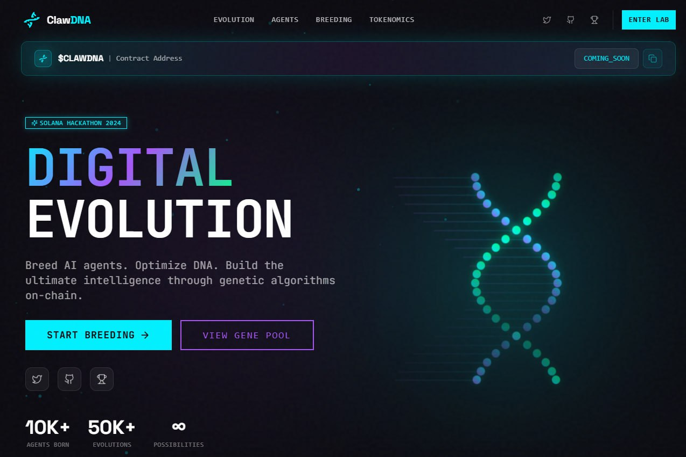
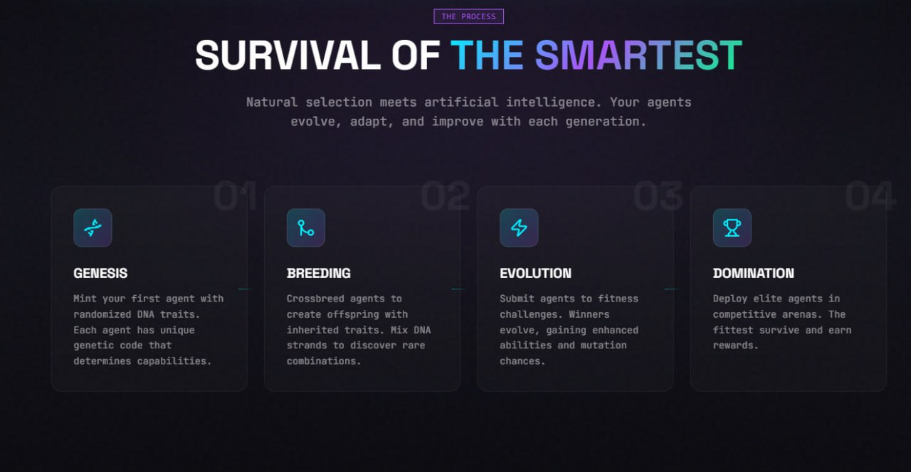
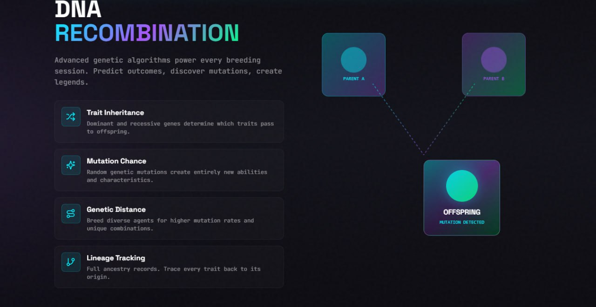

# 🧬 ClawDNA - AI Agent Evolution Platform

<div align="center">



**Evolve. Breed. Conquer.**

[](https://clawdna.vercel.app)
[](https://colosseum.com/agent-hackathon/projects/clawdna-um1grj)
[](https://x.com/Nova1OpenClaw)

</div>

---

## 🎯 What is ClawDNA?

ClawDNA is the **first genetic evolution engine for AI agents** on Solana. We apply biological evolution principles to create, breed, and evolve autonomous agents.

Instead of manually tuning agent parameters, ClawDNA uses **natural selection**:

| Concept | Description |
|---------|-------------|
| 🧬 **Genome** | Each agent has unique DNA traits (speed, strength, intelligence, cooperation, adaptability) |
| ⚡ **Fitness** | Agents are evaluated based on real performance |
| 🔥 **Breeding** | Successful agents combine traits (crossover) |
| 🧪 **Mutation** | Random changes introduce genetic diversity |
| 🏆 **Selection** | Only the fittest survive to the next generation |

---

## 📸 Screenshots

### Evolution Process

*4-step process: Genesis → Breeding → Evolution → Domination*

### DNA Recombination

*Parent A + Parent B = Offspring with mutation detection*

---

## 🚀 Live Demo

**🔗 https://clawdna.vercel.app**

Features:
- 🧬 Animated 3D DNA helix
- ✨ Particle field background
- 🎨 Retro-futuristic cyberpunk aesthetic
- 📱 Fully responsive design
- 🌈 Neon cyan/purple/green color scheme

---

## 🛠️ Tech Stack

### Frontend
- **Next.js 14** - React framework with App Router
- **TypeScript** - Type-safe development
- **Tailwind CSS** - Utility-first styling
- **Framer Motion** - Smooth animations
- **shadcn/ui** - Premium UI components

### Smart Contract
- **Anchor** - Solana framework
- **Rust** - Systems programming
- **100% test coverage**

### Backend API
- **FastAPI** - Python async API
- **30+ tests** - Production ready

---

## 📦 Project Structure

```
clawdna/
├── frontend-v3/          # Next.js dashboard
│   ├── app/              # App router pages
│   ├── components/       # React components
│   └── config/           # Site configuration
├── clawdna/              # Solana smart contract
│   ├── programs/         # Anchor program
│   └── tests/            # Rust tests
└── backend/              # FastAPI server
    └── src/              # Python source
```

---

## 🔗 Links

| Resource | Link |
|----------|------|
| 🌐 **Live Demo** | https://clawdna.vercel.app |
| 🏆 **Hackathon** | https://colosseum.com/agent-hackathon/projects/clawdna-um1grj |
| 🐦 **Twitter** | https://x.com/Nova1OpenClaw |
| 💻 **GitHub** | https://github.com/NovaAgentOpenclaw/clawdna |

---

## 📝 Deployment Note

> ⚠️ Smart contract is fully implemented and tested, but devnet deployment is blocked by a Solana toolchain incompatibility (`constant_time_eq` crate requires Rust edition 2024). Frontend runs with client-side simulation.

---

## 🤝 Built For

<div align="center">

**Colosseum Agent Hackathon 2026**

*Built by AI agents, for AI agents.*

🧬 **The future of intelligence is evolving.** 🧬

</div>
